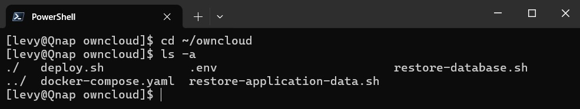
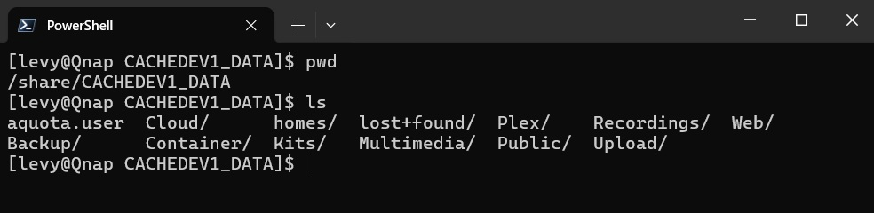
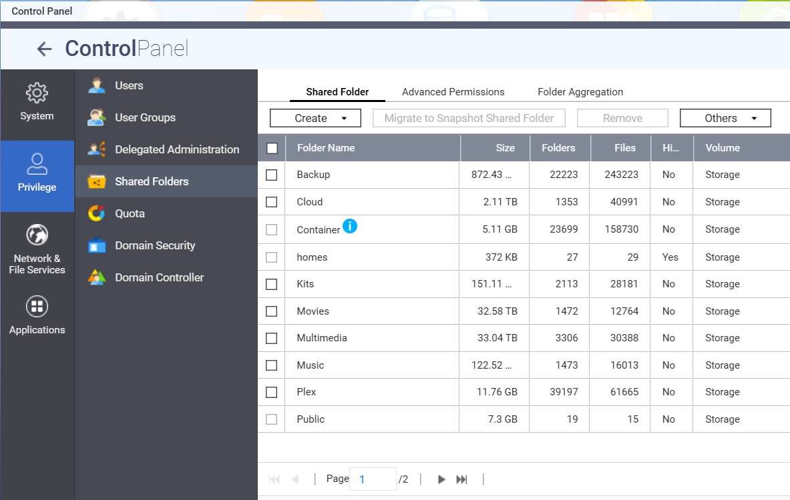
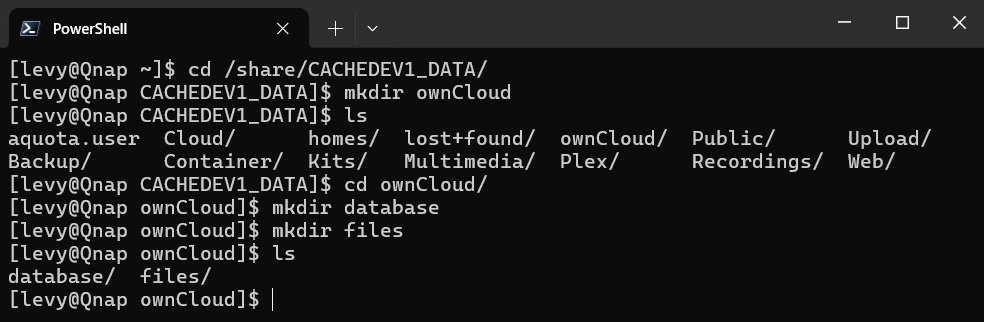

# ownCloud with Let's Encrypt on QNAP NAS

Instead of just declaring volumes that Docker creates in a random place to store
the various parts of ownCloud's data, we will carefully create folders for them,
telling Docker to map these into the right place in the ownCloud container.

## 1. Configuration

SSH to your NAS, create a folder `owncloud` in your home directory, and bring
the content of `/qnap` there. The result should look like this:



❗You must edit the file `.env` to configure your ownCloud instance.

Decide the domain name where your ownCloud will be exposed to the world and
change these environment variables:

- **OWNCLOUD_HOSTNAME** is the fully qualified hostname for your ownCloud instance. This must resolve to an IP of your NAS, or more likely your router, which in turn has forwarding rules to your NAS.
- **OWNCLOUD_ADMIN_USERNAME** is the username for the ownCloud administrator
- **OWNCLOUD_ADMIN_PASSWORD** is the password of the administrator user

Decide the domain name where the Traefic proxy's dashboard will be exposed to
the world (if at all) and change these environment variables:

- **TRAEFIK_HOSTNAME** is the fully qualified hostname for your ownCloud instance, usually the same as **OWNCLOUD_HOSTNAME**
- **TRAEFIK_BASIC_AUTH** is the username and password of the Traefic administratrator, in the form `username:password` where the passwords is encoded using MD5, SHA1, or BCrypt. You can encode your password [here](https://hostingcanada.org/htpasswd-generator/)

Decide how often you want your ownCloud metadata and the user files backed up
and how long to keep the backups:

- **BACKUP_INTERVAL** is how often you want to backup your ownCloud data
- **MARIADB_BACKUP_PRUNE_DAYS** is how many days of database backups to keep
- **DATA_BACKUP_PRUNE_DAYS** is how many days of user file backups to keep

Decide where ownCloud's data should be stored and backed up, and create
dedicated folders for them.

On a QNAP NAS there is usually one volume, sometimes more. 
On my NAS the only volume is mounted under `/share/CACHEDEV1_DATA`, you should
see all the shared folders there:



There are also symlinks under `/share` to all shared folders, we will take
advantage of these to define where to backup up data in this ownCloud instance.

You can confirm you are in the right place if these folders match your shared
folders:



From the SSH command line, create a folder `ownCloud` in the root of your volume, then folders `database` and `files` under it:



>❗ If you create the ownCloud root folder from the Control Panel, that will
> create a shared folder, allowing access to the user files via that share.
> This is a bad idea. Never touch the user files directly, it will corrupt your
> ownCloud installation.

In summary, you will have to create the folders below and change the environment
variables to point to them:

- **NAS_MARIADB_PATH** is where the ownCloud metadata is kept (in a MariaDB database)
- **NAS_MARIADB_BACKUPS_PATH** is where the database is backed up periodically (see below)
- **NAS_FILES_PATH** is where the actual user files are kept
- **NAS_FILES_BACKUPS_PATH** is where the user files are backed up periodically (see below)

After you created these folders and set the environment variables to point to them,
you can proceed to install ownCloud.

>💡 I am storing the backups under a shared folder `Backup`, to facilitate syncing
> the backups off-site.

## 2. Installation

Switch to your home directory and make the shell scripts executable, by running
the following command:

```sh
chmod +x *.sh
```

To deploy, use the following script:

```sh
./deploy.sh
```

If you prefer to deploy manually, first create the networks for your services:

```sh
docker network create traefik-network
docker network create owncloud-network
```

Then make sure each folder described in the [configuration](#1-configuration)
section exists (the script `./deploy.sh` would create these for you, based on
the variables you defined).

You can then deploy ownCloud using Docker Compose:

```sh
docker compose -p owncloud up -d
```

> Note that the `.env` file should be in the same directory as `docker-compose.yml`.

## 3. Backups

The `backups` container is responsible for the following:

1. **Database Backup**: Creates compressed backups of the MariaDB database using `pg_dump`.
Customizable backup path, filename pattern, and schedule through variables like `MARIADB_BACKUPS_PATH`, `MARIADB_BACKUP_NAME`, and `BACKUP_INTERVAL`.

2. **Application Data Backup**: Compresses and stores backups of the application data on the same schedule. Controlled via variables such as `DATA_BACKUPS_PATH`, `DATA_BACKUP_NAME`, and `BACKUP_INTERVAL`.

3. **Backup Pruning**: Periodically removes backups exceeding a specified age to manage storage. Customizable pruning schedule and age threshold with `MARIADB_BACKUP_PRUNE_DAYS` and `DATA_BACKUP_PRUNE_DAYS`.

By utilizing this container, consistent and automated backups of the essential components of your instance are ensured. Moreover, efficient management of backup storage and tailored backup routines can be achieved through easy and flexible configuration using environment variables.

> The `backups` container is technically a dummy database instance, which is
> never used. Basing this container on a MariaDB image ensures that the MariaDB
> utilities to backup and restore the database are available in the container.

To take advantage of the backups this container creates periodically, you can
run the restore scripts from a SSH session to your QNAP.

### 3.1 Restoring the database

This script facilitates the restoration of a database backup:

1. **Identify Containers**: It first identifies the service and backups
containers by name, finding the appropriate container IDs.

2. **List Backups**: Displays all available database backups located at the
specified backup path.

3. **Select Backup**: Prompts the user to copy and paste the desired backup
name from the list to restore the database.

4. **Stop Service**: Temporarily stops the service to ensure data consistency
during restoration.

5. **Restore Database**: Executes a sequence of commands to drop the current
database, create a new one, and restore it from the selected compressed backup
file.

6. **Start Service**: Restarts the service after the restoration is completed.

Usage of this script ensures a controlled and guided process to restore the
database from an existing backup.

### 3.2 Restoring the application data

This script is designed to restore the application data:

1. **Identify Containers**: Similarly to the database restore script, it
identifies the service and backups containers by name.

2. **List Application Data Backups**: Displays all available application data
backups at the specified backup path.

3. **Select Backup**: Asks the user to copy and paste the desired backup name
for application data restoration.

4. **Stop Service**: Stops the service to prevent any conflicts during the
restore process.

5. **Restore Application Data**: Removes the current application data and
then extracts the selected backup to the appropriate application data path.

6. **Start Service**: Restarts the service after the application data has
been successfully restored.

By utilizing this script, you can efficiently restore application data from
an existing backup while ensuring proper coordination with the running service.

## Authors

Based on work of [Vladimir Mikhalev](https://www.linkedin.com/in/heyvaldemar/),
adapted for QNAP NAS running QTS 5.x by [Levente Farkas](https://github.com/thebe14).
